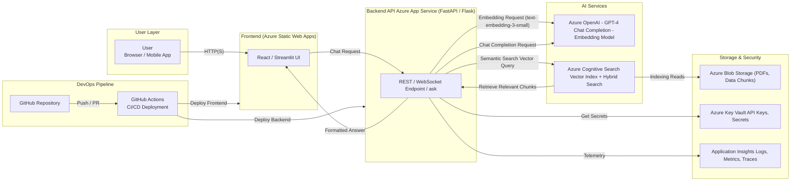

# RAG Chatbot with Azure OpenAI

A Retrieval-Augmented Generation (RAG) chatbot built with FastAPI and Azure OpenAI, featuring chat completions and text embeddings capabilities.

## Features

- 🤖 Chat completion using Azure OpenAI (GPT-5)
- 📊 Text embedding generation using Azure OpenAI
- 🚀 FastAPI REST API
- 🔐 Azure API Management (APIM) integration
- 🔄 Auto-reload development server

## Tech Stack

- **Framework:** FastAPI
- **AI Service:** Azure OpenAI
- **Python Libraries:**
  - `openai` - Azure OpenAI SDK
  - `uvicorn` - ASGI server
  - `python-dotenv` - Environment variable management
  - `azure-search-documents` - Azure Cognitive Search
  - `azure-storage-blob` - Azure Blob Storage
  - `pypdf` - PDF processing

## Architecture

The system follows a modern cloud-native architecture with Azure services:



### Architecture Components

- **User Layer**: Web browsers and mobile applications
- **Frontend**: Azure Static Web Apps hosting React/Streamlit UI
- **Backend API**: FastAPI service deployed on Azure App Service
- **AI Services**:
  - Azure OpenAI for chat completions (GPT-5) and embeddings (text-embedding-3-small)
  - Azure Cognitive Search for vector indexing and hybrid search
- **Storage & Security**:
  - Azure Blob Storage for document storage
  - Azure Key Vault for secrets management
  - Application Insights for monitoring and telemetry
- **DevOps**: GitHub Actions for CI/CD pipeline

## Prerequisites

- Python 3.8+
- Azure OpenAI account with deployed models
- Azure API Management (APIM) subscription key
- Conda (recommended) or virtualenv

## Setup

1. **Clone the repository**

   ```bash
   git clone https://github.com/amrodrg/rag-chatbot-azure.git
   cd rag-chatbot-azure
   ```

2. **Create and activate conda environment**

   ```bash
   conda create -n rag_chatbot_azure python=3.10
   conda activate rag_chatbot_azure
   ```

3. **Install dependencies**

   ```bash
   pip install -r requirements.txt
   ```

4. **Configure environment variables**

   Create a `.env` file in the project root:

   ```env
   AZURE_OPENAI_ENDPOINT=https://your-apim-endpoint.azure-api.net/your-path
   AZURE_OPENAI_API_KEY=your-apim-subscription-key
   AZURE_OPENAI_CHAT_DEPLOYMENT=gpt-5
   AZURE_OPENAI_EMBEDDING_DEPLOYMENT=text-embedding-3-small
   API_VERSION=2025-01-01-preview
   ```

   **Important:** Never commit your `.env` file to version control!

## Running the Application

Start the development server:

```bash
conda activate rag_chatbot_azure
uvicorn main:app --reload --port 8001
```

The API will be available at `http://127.0.0.1:8001`

## API Endpoints

### Health Check

```http
GET /health
```

### Root

```http
GET /
```

### Chat Completion

```http
POST /chat
Content-Type: application/json

{
  "question": "Your question here",
  "history": [
    {
      "role": "user",
      "content": "Previous message"
    }
  ],
  "language": "en"
}
```

**Response:**

```json
{
  "answer": "AI generated response"
}
```

### Text Embedding

```http
POST /embed
Content-Type: application/json

{
  "text": "Text to embed"
}
```

**Response:**

```json
{
  "embedding": [0.123, -0.456, ...],
  "dimensions": 1536
}
```

## Interactive API Documentation

Once the server is running, visit:

- Swagger UI: `http://127.0.0.1:8001/docs`
- ReDoc: `http://127.0.0.1:8001/redoc`

## Testing the Connection

Run the test scripts to verify your Azure OpenAI connection:

```bash
python test_connection.py
python test_endpoints.py
```

## Project Structure

```
rag_chatbot_azure/
├── main.py                 # FastAPI application
├── ingest.py              # Data ingestion (coming soon)
├── requirements.txt       # Python dependencies
├── .env                   # Environment variables (not in git)
├── .gitignore            # Git ignore rules
└── README.md             # This file
```

## Configuration Notes

### Azure API Management (APIM)

This project uses Azure API Management. The authentication requires the `Ocp-Apim-Subscription-Key` header, which is automatically added to all requests.

### GPT-5 Model

The GPT-5 model requires the `max_completion_tokens` parameter instead of `max_tokens`.

## Author

[amrodrg](https://github.com/amrodrg)
